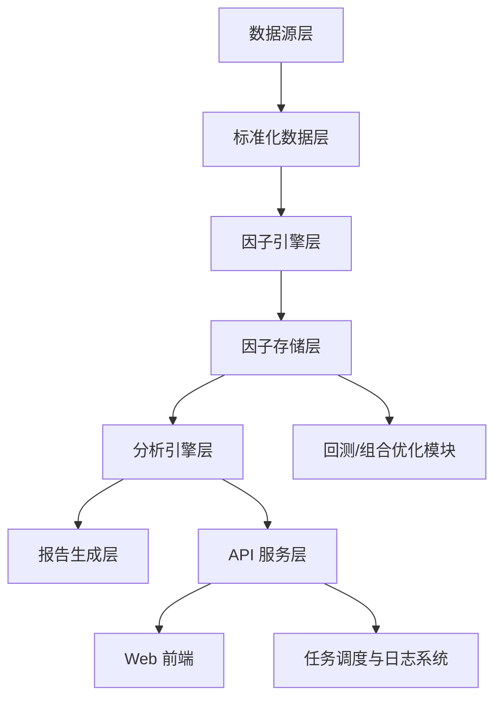

# Factor Library & Factor Analytics Platform  
# 因子库与因子分析平台主设计文档

## 1. 项目名称

**Factor Library & Factor Analytics Platform**  
**因子库与因子分析平台主设计文档**

## 2. 文档目的

本文档用于统一因子库与因子分析平台项目的总体目标、系统架构、模块边界、数据标准、研发流程、验收标准与实施路线，作为：

- 产品设计依据
- 技术实现蓝图
- Codex 执行提示主文档
- 团队协同开发基线
- 后续子文档拆分母版

本文档面向以下角色：

- 量化研究员
- 平台后端工程师
- 前端工程师
- 数据工程师
- DevOps / 运维
- 项目负责人

## 3. 项目背景

因子研究通常存在以下典型问题：

1. **因子定义分散**：研究脚本碎片化，不同人对同一因子实现口径不一致。
2. **因子结果不可复现**：缺乏版本管理、参数记录和运行日志。
3. **分析流程不统一**：去极值、标准化、中性化、收益定义、分组方式各自为政。
4. **结果展示不系统**：报告输出、图表、对比分析、归档机制缺失。
5. **难以平台化复用**：研究成果无法稳定接入回测、选股、组合优化、实时监控等后续系统。

因此，本项目的核心目标不是“写一批因子代码”，而是建立一个**标准化、可扩展、可复现、可分析、可平台化接入**的因子工程体系。

## 4. 总体目标

### 4.1 业务目标

构建一个支持以下能力的一体化平台：

- 建立标准化因子库
- 支持因子批量计算与增量更新
- 支持单因子/多因子分析
- 支持因子版本管理与元数据管理
- 支持自动化生成因子分析报告
- 支持因子与回测平台、研究平台、选股平台联动

### 4.2 技术目标

平台应满足以下技术要求：

- **高可维护性**：模块清晰、解耦、支持扩展
- **高可复现性**：每次分析必须可追踪计算条件
- **高可扩展性**：可逐步支持多市场、多频率、多数据源
- **高可观测性**：日志、任务状态、结果归档可查询
- **高一致性**：统一的因子定义、预处理与评价口径

### 4.3 第一阶段范围

第一阶段聚焦 **A股日频因子研究平台 MVP**：

- 市场：A股
- 频率：日频
- 资产类型：股票
- 数据类型：行情、复权、行业、市值、财务、基础风格暴露
- 功能重点：因子库 + 单因子分析 + 多因子基础组合 + PDF/HTML报告
- 不在第一阶段强制实现：分钟级、实时撮合、复杂权限系统、正式生产部署集群

## 5. 设计原则

### 5.1 标准化优先

所有因子必须具备标准命名、依赖描述、参数定义、输出格式、版本号和状态标识。

### 5.2 研究与工程并重

平台既要服务研究探索，也要为后续回测、策略部署、组合优化提供工程接口。

### 5.3 元数据先行

不允许“只有结果没有上下文”。每个因子的定义、运行配置、分析配置、输出结果都必须有元数据可追踪。

### 5.4 可复现优先于一次性跑通

每次分析任务都必须记录：

- 数据区间
- 股票池
- 收益定义
- 去极值方法
- 标准化方法
- 中性化方法
- 版本号
- 参数集
- 任务时间戳

### 5.5 松耦合分层设计

至少分为：

- 数据层
- 因子引擎层
- 分析层
- 平台服务层
- 展示层

### 5.6 报告自动化

平台要具备自动生成高质量图文报告能力，减少研究员重复劳动。

## 6. 非目标（当前阶段不做）

以下功能不作为第一阶段必须项：

- 实时高频因子计算
- Tick 级与盘口级建模
- 正式 OMS / EMS 对接
- 生产级多租户权限系统
- 实盘下单
- 超复杂因子市场中性组合交易系统
- 跨券商交易适配

这些能力可在第二、第三阶段扩展。

## 7. 总体系统架构

### 7.1 分层架构



### 7.2 架构分层说明

#### A. 数据源层

负责接入：

- 行情数据
- 复权数据
- 财务数据
- 行业分类
- 风格暴露
- 宏观数据
- 另类数据（后续）

#### B. 标准化数据层

负责统一字段命名、时间对齐、缺失处理、复权逻辑、资产主键映射。

#### C. 因子引擎层

负责因子定义、注册、依赖解析、计算执行、缓存与增量更新。

#### D. 因子存储层

负责存储因子值、元数据、版本、分析结果、任务日志。

#### E. 分析引擎层

负责：

- 预处理
- 中性化
- IC / RankIC
- 分组收益
- 多空组合
- 稳定性分析
- 因子相关性
- 综合评分

#### F. 报告生成层

负责 HTML/PDF 报告生成、图表输出、研究记录归档。

#### G. API 服务层

提供平台调用接口与前端数据访问接口。

#### H. Web 前端

提供交互界面，包括因子总览、单因子详情、因子比较、任务中心等。

#### I. 回测/组合优化模块

供后续与 qlib、Backtrader、自定义组合模块对接。

#### J. 调度与日志系统

负责任务编排、异步执行、状态跟踪、重试、告警。

## 8. 技术栈建议

### 8.1 后端

- Python 3.11+
- FastAPI
- Pydantic
- SQLAlchemy
- Alembic
- Celery 或 APScheduler
- Redis（缓存 / 队列）

### 8.2 数据处理

- pandas
- numpy
- scipy
- statsmodels
- scikit-learn
- polars（可选，用于后续性能优化）

### 8.3 存储

- Parquet：研究数据与中间结果
- PostgreSQL：元数据、任务、配置
- ClickHouse：大规模因子值查询（第二阶段建议接入）

### 8.4 前端

- React
- TypeScript
- Ant Design 或 shadcn/ui
- ECharts / Plotly.js

### 8.5 报告与可视化

- matplotlib
- plotly
- Jinja2
- WeasyPrint / reportlab

### 8.6 测试与质量控制

- pytest
- mypy
- ruff / black
- pre-commit

### 8.7 部署

- Docker
- docker-compose（第一阶段）
- CI/CD（GitHub Actions / GitLab CI，视团队环境而定）

## 9. 项目目录结构

```text
factor_platform/
├─ README.md
├─ docs/
│  ├─ FACTOR_PLATFORM_MASTER_PLAN.md
│  ├─ FACTOR_METADATA_SPEC.md
│  ├─ FACTOR_ANALYTICS_SPEC.md
│  ├─ API_SPEC.md
│  ├─ DB_SCHEMA.md
│  ├─ REPORT_TEMPLATE_SPEC.md
│  └─ DEPLOYMENT_PLAN.md
├─ config/
│  ├─ app.yaml
│  ├─ data_sources.yaml
│  ├─ universes.yaml
│  ├─ factor_defaults.yaml
│  └─ report.yaml
├─ data/
│  ├─ raw/
│  ├─ processed/
│  ├─ cache/
│  └─ exports/
├─ db/
│  ├─ migrations/
│  └─ seed/
├─ app/
│  ├─ api/
│  │  ├─ routers/
│  │  ├─ schemas/
│  │  ├─ dependencies/
│  │  └─ app.py
│  ├─ core/
│  │  ├─ settings.py
│  │  ├─ logger.py
│  │  ├─ enums.py
│  │  └─ exceptions.py
│  ├─ datahub/
│  │  ├─ loaders/
│  │  ├─ adapters/
│  │  ├─ cleaners/
│  │  ├─ aligners/
│  │  └─ services/
│  ├─ factors/
│  │  ├─ base.py
│  │  ├─ registry.py
│  │  ├─ builders/
│  │  ├─ technical/
│  │  ├─ fundamental/
│  │  ├─ volatility/
│  │  ├─ moneyflow/
│  │  ├─ risk/
│  │  ├─ alternative/
│  │  └─ decomposition/
│  ├─ analytics/
│  │  ├─ preprocessing/
│  │  ├─ neutralization/
│  │  ├─ ic/
│  │  ├─ grouping/
│  │  ├─ portfolio/
│  │  ├─ correlation/
│  │  ├─ stability/
│  │  ├─ scoring/
│  │  └─ utils/
│  ├─ reports/
│  │  ├─ templates/
│  │  ├─ figures/
│  │  └─ generators/
│  ├─ tasks/
│  │  ├─ factor_jobs.py
│  │  ├─ analytics_jobs.py
│  │  ├─ report_jobs.py
│  │  └─ scheduler.py
│  ├─ models/
│  │  ├─ db_models.py
│  │  └─ domain_models.py
│  └─ services/
│     ├─ factor_service.py
│     ├─ analytics_service.py
│     ├─ report_service.py
│     └─ task_service.py
├─ web/
│  ├─ src/
│  ├─ public/
│  └─ package.json
├─ tests/
│  ├─ unit/
│  ├─ integration/
│  └─ e2e/
└─ scripts/
   ├─ init_db.py
   ├─ sync_data.py
   ├─ run_factor_batch.py
   └─ generate_report.py
```

## 10. 数据层设计

### 10.1 数据源范围

第一阶段建议接入以下数据：

#### 必需数据

- 日线行情：open, high, low, close, volume, amount
- 复权因子
- 股票基本信息
- 交易日历
- 行业分类
- 总市值 / 流通市值
- 财务指标（核心字段）
- ST / 停牌 / 上市天数等过滤字段

#### 建议数据

- 风格暴露（size, beta, volatility 等）
- 换手率
- 估值指标
- 北向资金 / 主力资金（后续增强）

#### 后续扩展

- 新闻文本
- 研报一致预期
- 公告事件
- 宏观序列
- 期权隐含波动率

### 10.2 标准化数据表建议

#### 10.2.1 trading_calendar

| 字段 | 类型 | 说明 |
| --- | --- | --- |
| trade_date | date | 交易日 |
| is_open | bool | 是否开市 |
| market | varchar | 市场标识 |

#### 10.2.2 asset_basic_info

| 字段 | 类型 | 说明 |
| --- | --- | --- |
| asset_code | varchar | 统一资产代码 |
| symbol | varchar | 原始代码 |
| asset_name | varchar | 名称 |
| market | varchar | 市场 |
| list_date | date | 上市日期 |
| delist_date | date | 退市日期 |
| board | varchar | 板块 |
| status | varchar | 上市状态 |

#### 10.2.3 daily_bar

| 字段 | 类型 | 说明 |
| --- | --- | --- |
| trade_date | date | 交易日 |
| asset_code | varchar | 资产代码 |
| open | numeric | 开盘价 |
| high | numeric | 最高价 |
| low | numeric | 最低价 |
| close | numeric | 收盘价 |
| volume | numeric | 成交量 |
| amount | numeric | 成交额 |
| turnover_rate | numeric | 换手率 |
| adj_factor | numeric | 复权因子 |

#### 10.2.4 industry_classification

| 字段 | 类型 | 说明 |
| --- | --- | --- |
| trade_date | date | 交易日 |
| asset_code | varchar | 资产代码 |
| industry_lv1 | varchar | 一级行业 |
| industry_lv2 | varchar | 二级行业 |
| provider | varchar | 行业体系来源 |

#### 10.2.5 financial_indicator

| 字段 | 类型 | 说明 |
| --- | --- | --- |
| report_date | date | 报告期 |
| announce_date | date | 公告日 |
| asset_code | varchar | 资产代码 |
| revenue | numeric | 营业收入 |
| net_profit | numeric | 净利润 |
| roe | numeric | ROE |
| roa | numeric | ROA |
| gross_margin | numeric | 毛利率 |
| pe | numeric | PE |
| pb | numeric | PB |
| ps | numeric | PS |

#### 10.2.6 risk_exposure

| 字段 | 类型 | 说明 |
| --- | --- | --- |
| trade_date | date | 交易日 |
| asset_code | varchar | 资产代码 |
| size | numeric | 市值风格暴露 |
| beta | numeric | Beta |
| volatility | numeric | 波动 |
| momentum | numeric | 动量 |
| liquidity | numeric | 流动性 |

### 10.3 数据层设计要求

必须满足：

- 所有表以 trade_date + asset_code 作为横截面主键基础
- 财务数据必须保留 announce_date，避免未来函数
- 所有可交易过滤条件需有明确字段支持
- 数据清洗逻辑必须模块化并可重跑
- 原始数据与标准化数据分层存储

数据一致性要求：

- 同一资产代码必须统一映射
- 因子计算依赖数据必须有数据血缘关系记录
- 不允许静默填补关键缺失值
- 财务数据必须遵守可得性时点约束

## 11. 因子库设计

### 11.1 因子定义原则

每个因子必须回答以下问题：

- 因子名称是什么？
- 数学定义是什么？
- 输入依赖有哪些？
- 支持什么市场和频率？
- 有哪些可调参数？
- 输出是什么？
- 是否需要预处理？
- 是否建议中性化？
- 经济学含义是什么？
- 当前状态是什么（实验/验证/上线/废弃）？

### 11.2 因子分类体系

第一阶段建议建立以下因子大类：

- **A. 趋势类**：MA Bias、MA Slope、MACD、ADX、Trend Persistence
- **B. 动量与反转类**：MOM_5 / MOM_20 / MOM_60、Reversal_5、Residual Momentum
- **C. 波动率类**：ATR、Historical Volatility、Parkinson Volatility、Downside Volatility
- **D. 成交量/资金流类**：Volume Ratio、OBV、MFI、Turnover Change、Price-Volume Divergence
- **E. 估值类**：PE、PB、PS、Dividend Yield、EV/EBITDA（如数据可得）
- **F. 质量类**：ROE、ROA、Gross Margin、Cash Flow Quality、Asset Turnover
- **G. 成长类**：Revenue Growth、Profit Growth、R&D Intensity、Capex Growth
- **H. 风险类**：Beta、Idiosyncratic Volatility、Tail Risk Proxy、Max Drawdown Sensitivity
- **I. 结构分解类**：IMF_1、IMF_2、IMF_3、IMF_4、CEEMDAN-derived signals
- **J. 另类与文本类（后续）**：数字化转型文本因子、公告情绪因子、新闻热度因子、分析师一致预期修正因子

### 11.3 因子命名规范

统一采用以下命名建议：

{CATEGORY}_{CORE_NAME}_{PARAMS}_{FREQ}_{VERSION}

例如：

- TREND_MACD_12_26_9_D_V1
- MOM_RET_20_D_V1
- VOL_ATR_14_D_V1
- FUND_ROE_Q_V1
- DECOMP_IMF1_D_V1

命名要求：

- 全大写或统一蛇形命名，团队内必须固定一种
- 参数需显式体现
- 频率需可识别
- 版本号需显式保留
- 不允许使用含糊命名，如 factor1、my_alpha、test_x

### 11.4 因子元数据结构

建议建立 factor_metadata 表。

表结构建议：

| 字段 | 类型 | 说明 |
| --- | --- | --- |
| factor_name | varchar | 因子唯一标识 |
| display_name | varchar | 展示名 |
| category | varchar | 因子类别 |
| description | text | 描述 |
| formula_text | text | 数学公式/伪代码 |
| dependencies | jsonb | 输入字段依赖 |
| parameter_schema | jsonb | 参数定义 |
| freq_supported | jsonb | 支持频率 |
| market_supported | jsonb | 支持市场 |
| preprocess_default | jsonb | 默认预处理 |
| neutralization_default | jsonb | 默认中性化配置 |
| author | varchar | 作者 |
| owner | varchar | 负责人 |
| status | varchar | experimental/validated/production/deprecated |
| created_at | timestamp | 创建时间 |
| updated_at | timestamp | 更新时间 |

### 11.5 因子值存储结构

建议建立 factor_value_store。

表结构建议：

| 字段 | 类型 | 说明 |
| --- | --- | --- |
| trade_date | date | 日期 |
| asset_code | varchar | 资产 |
| factor_name | varchar | 因子名 |
| factor_version | varchar | 版本 |
| factor_value | numeric | 因子值 |
| freq | varchar | 频率 |
| universe | varchar | 股票池 |
| preprocess_tag | varchar | 预处理标签 |
| neutralize_tag | varchar | 中性化标签 |
| calc_batch_id | varchar | 计算批次 |
| created_at | timestamp | 入库时间 |

关键要求：

- 必须允许同一因子在不同版本并存
- 必须允许同一因子在不同股票池、不同预处理口径下并存
- 必须能根据批次号追溯计算来源

## 12. 因子引擎设计

### 12.1 核心职责

因子引擎负责：

- 因子注册
- 因子依赖解析
- 参数校验
- 因子计算
- 结果缓存
- 增量更新
- 版本控制
- 批量执行

### 12.2 核心对象设计

#### 12.2.1 BaseFactor

所有因子类统一继承，建议包含方法：

- name()
- version()
- dependencies()
- parameter_schema()
- validate_params()
- compute(data_bundle, params)
- post_check(output_df)
- describe()

#### 12.2.2 FactorRegistry

负责因子注册、查询、发现、加载。

#### 12.2.3 FactorRunner

负责单因子或批量因子运行，包括：加载依赖数据、校验数据完整性、执行 compute、做输出校验、存储结果、记录日志。

#### 12.2.4 FactorBatchExecutor

负责：批量任务、参数扫描、增量更新、失败重试。

### 12.3 运行流程

### 12.4 输出校验规则

所有因子输出都必须执行基础校验：

- 是否包含 trade_date
- 是否包含 asset_code
- 是否包含 factor_value
- 是否存在全空结果
- 是否存在过多无穷值
- 是否存在异常重复键
- 是否满足预期覆盖率阈值
- 是否满足参数签名记录要求

### 12.5 增量更新原则

因子引擎需要支持按交易日增量更新：

- 只重新计算新增日期
- 避免全历史重复运算
- 对依赖修订（例如财务重述）支持回补重算
- 支持通过 calc_batch_id 区分新旧批次

## 13. 因子分析引擎设计

### 13.1 核心分析能力

- **A. 基础统计**：均值、标准差、偏度、峰度、缺失率、覆盖率、极值比例
- **B. 预处理分析**：原始分布、去极值前后对比、标准化前后对比、中性化前后对比
- **C. 预测能力分析**：IC、RankIC、ICIR、月度 IC、年度 IC、滚动 IC
- **D. 分组收益分析**：5 组 / 10 组分层、分组收益均值、分组累计收益、多空净值、单调性检验
- **E. 可交易性分析**：换手率、持仓稳定性、规模偏置、流动性约束敏感性
- **F. 稳定性分析**：分年份表现、牛熊市表现、行业分组表现、不同市值区间表现
- **G. 相关性与冗余性分析**：因子相关矩阵、横截面相关、时序相关、聚类热力图、正交化前后表现
- **H. 综合评分**：预测性得分、稳定性得分、可交易性得分、独立性得分、可解释性得分

### 13.2 因子预处理规范

默认分析流程建议如下：

- 股票池过滤
- 上市天数过滤
- ST / 停牌过滤
- 缺失值处理
- 去极值（MAD / 分位数裁剪）
- 标准化（z-score）
- 中性化（行业 + 市值）
- 收益对齐
- 进行分析

默认配置建议：

- 去极值：MAD 5 倍
- 标准化：横截面 z-score
- 中性化：行业哑变量 + log(market_cap) 残差回归
- 收益定义：未来 1 日 / 5 日 / 20 日收益可切换

### 13.3 收益定义规范

需明确以下口径：

- forward_return_1d
- forward_return_5d
- forward_return_10d
- forward_return_20d

重要要求：

- 收益计算必须避免未来函数
- 复权价格口径必须统一
- 调仓频率与收益口径要保持一致
- 所有报告必须显示收益定义

### 13.4 中性化规范

默认支持：

- 无中性化
- 市值中性化
- 行业中性化
- 行业 + 市值中性化
- 风格中性化（第二阶段）

推荐默认方案：以横截面回归方式做残差化：

factor ~ industry_dummies + log(market_cap)

输出残差作为中性化后因子值。

### 13.5 因子评分体系

建议建立统一评分公式：

```text
FinalScore = w1 * PredictiveScore
           + w2 * StabilityScore
           + w3 * TradabilityScore
           + w4 * IndependenceScore
           + w5 * InterpretabilityScore
```

默认权重建议：

- PredictiveScore: 0.35
- StabilityScore: 0.25
- TradabilityScore: 0.15
- IndependenceScore: 0.15
- InterpretabilityScore: 0.10

评分说明：

- PredictiveScore：IC mean、RankIC mean、ICIR、分组单调性
- StabilityScore：滚动 IC 波动、年度一致性、牛熊市一致性
- TradabilityScore：换手率、流动性适应性、极端小市值依赖程度
- IndependenceScore：与核心因子相关性、正交化后剩余有效性
- InterpretabilityScore：因子经济学含义、参数复杂度、是否具有合理研究逻辑

## 14. 报告系统设计

### 14.1 报告输出形式

第一阶段支持：HTML 报告、PDF 报告、PNG/SVG 图表导出。

### 14.2 单因子报告内容模板

建议至少包含以下章节：

- 因子概览：因子名称、类别、数学定义、参数、依赖字段、分析范围（数据区间、股票池）
- 基础统计：均值/标准差/偏度/峰度、缺失率、覆盖率、分布图
- 预处理结果：去极值前后分布、中性化前后对比
- IC 分析：IC 时序、RankIC 时序、月度 IC 柱状图、ICIR 指标
- 分层收益分析：分组收益条形图、分组累计净值图、多空组合净值图、单调性表格
- 稳定性分析：年度表现、分市场状态表现、分行业表现
- 风险与偏置：市值偏置、行业偏置、流动性偏置
- 结论与建议：是否推荐进入候选池、推荐使用场景、风险提示、后续优化方向

### 14.3 多因子比较报告

支持：多因子 IC 对比、多因子相关性、多因子多空表现对比、综合评分排行、组合建议。

## 15. 平台前端设计

### 15.1 页面清单

- **A. 首页 / 总览页**：因子总数、各类别分布、最近更新、表现 Top 因子、待审核因子、最近任务状态
- **B. 因子列表页**：搜索、按类别筛选、按状态筛选、按评分排序、按更新时间排序
- **C. 单因子详情页**：因子元数据、历史版本、分析图表、报告下载、最近计算任务
- **D. 因子比较页**：多因子横向比较
- **E. 因子组合页**：选择因子构建简单组合并查看结果
- **F. 任务中心**：因子计算任务、分析任务、报告任务、失败原因、重试入口
- **G. 配置中心（可后置）**：股票池、数据源、默认分析参数、报告模板

### 15.2 前端核心组件

因子卡片、指标概览卡、时间序列图、热力图、分组收益图、任务状态表、报告预览面板、版本对比弹窗。

## 16. API 设计

### 16.1 API 设计原则

- RESTful 为主
- 统一返回结构
- 所有异步任务返回 task_id
- 支持分页、筛选、排序
- 支持查看任务状态与日志摘要

### 16.2 关键 API 列表

因子元数据：GET /api/factors，GET /api/factors/{factor_name}，POST /api/factors/register，PUT /api/factors/{factor_name}，GET /api/factors/{factor_name}/versions

因子计算：POST /api/factors/run，POST /api/factors/run-batch，GET /api/tasks/{task_id}

因子分析：POST /api/analytics/single-factor，POST /api/analytics/compare，POST /api/analytics/composite

报告：POST /api/reports/generate，GET /api/reports/{report_id}，GET /api/reports/{report_id}/download

任务与日志：GET /api/tasks，GET /api/tasks/{task_id}/logs，POST /api/tasks/{task_id}/retry

配置：GET /api/universes，GET /api/config/defaults

### 16.3 API 返回结构建议

```json
{
  "success": true,
  "message": "ok",
  "data": {},
  "meta": {},
  "error": null
}
```

异步任务返回示例：

```json
{
  "success": true,
  "message": "task submitted",
  "data": {
    "task_id": "task_20260319_0001",
    "status": "queued"
  },
  "error": null
}
```

## 17. 任务调度与日志设计

### 17.1 任务类型

数据同步任务、因子计算任务、因子分析任务、报告生成任务、批量比较任务。

### 17.2 任务状态

queued、running、success、failed、cancelled、retrying。

### 17.3 日志要求

每个任务至少记录：task_id、task_type、submitted_at、started_at、finished_at、params_snapshot、status、error_message、retry_count、operator、artifact_paths。

## 18. 权限与角色（MVP 简化版）

第一阶段可以简化为：admin、researcher、viewer。

权限建议：

- admin：全部权限、配置管理、删除任务、修改状态
- researcher：创建因子、发起计算、发起分析、下载报告
- viewer：查看结果、下载公开报告

## 19. 性能与扩展性要求

### 19.1 性能要求（MVP）

- 单因子日频全A计算：应在合理时间内完成
- 单因子分析任务：支持异步
- 因子列表页：分页查询快速响应
- 因子详情图表：避免实时重算，优先读取已归档结果

### 19.2 扩展性要求

未来可扩展到：多市场（港股、美股、期货、基金）、多频率（分钟级）、多数据源、多任务并发、ClickHouse 加速查询、回测平台联动、模型预测平台联动。

## 20. 测试策略

### 20.1 单元测试

覆盖：因子计算逻辑、参数校验逻辑、中性化逻辑、收益对齐逻辑、API schema 校验。

### 20.2 集成测试

覆盖：数据加载 → 因子计算 → 分析 → 报告生成全链路、异步任务状态切换、数据入库与查询一致性。

### 20.3 回归测试

新版本上线前必须验证：核心因子输出未异常漂移、分析结果变化在可解释范围内、报告模板未破坏。

## 21. 质量控制与开发规范

### 21.1 代码规范

- Python 统一 black / ruff
- 类型注解覆盖关键模块
- 核心函数必须写 docstring
- 数据处理逻辑禁止写在 API 层

### 21.2 Git 规范

建议采用：main、develop、feature/*、hotfix/*。

### 21.3 提交规范

建议使用 Conventional Commits：feat:、fix:、refactor:、docs:、test:、chore:。

## 22. 项目实施路线图

- **Phase 0：项目规范与设计**：交付 FACTOR_PLATFORM_MASTER_PLAN.md、FACTOR_METADATA_SPEC.md、DB_SCHEMA.md、API_SPEC.md
- **Phase 1：数据底座建设**：数据同步脚本、数据清洗模块、基础表结构
- **Phase 2：因子引擎 MVP**：FactorRegistry、FactorRunner、首批因子实现
- **Phase 3：分析引擎 MVP**：单因子分析服务、分析结果表、基础图表输出
- **Phase 4：报告系统**：报告模板、报告生成器、下载接口
- **Phase 5：前后端平台 MVP**：API、前端页面、异步任务联动
- **Phase 6：增强功能**：多因子组合、参数扫描、因子版本比较、ClickHouse 加速、回测模块接入

## 23. MVP 范围定义

MVP 必须完成：

- 数据标准化层
- 因子元数据管理
- 因子注册与运行
- 单因子分析
- HTML/PDF 报告
- 因子列表页
- 因子详情页
- 任务中心

MVP 建议首批因子数：20 ~ 50 个。

MVP 首批因子建议：MOM_5、MOM_20、MOM_60、REV_5、MA_BIAS_5、MA_BIAS_20、MA_SLOPE_20、MACD、ATR_14、HV_20、VOL_RATIO_5、OBV、TURNOVER_CHANGE_5、PE、PB、ROE、ROA、REVENUE_GROWTH、PROFIT_GROWTH、IMF1 ~ IMF4（如数据与流程已备齐）。

## 24. 验收标准

### 24.1 功能验收

能注册新因子、能运行单因子计算、能批量运行首批因子、能查看因子详情与版本、能完成单因子分析、能导出报告、能查询任务状态。

### 24.2 数据验收

因子值表字段完整、因子元数据完整、分析结果可追溯、不存在未来函数明显错误、数据缺失与异常有记录。

### 24.3 报告验收

报告必须包含：因子说明、基础统计、IC 图、分组收益图、多空净值图、稳定性分析、结论摘要。

### 24.4 工程验收

核心模块具备测试、日志完整、可通过配置切换股票池和分析参数、可重跑任务并归档结果。

## 25. 风险与应对

- 风险：数据口径不一致；应对：建立统一字段标准与数据清洗规范
- 风险：因子定义失控；应对：强制元数据与命名规范，所有新因子必须注册
- 风险：分析结果不可复现；应对：记录任务参数快照、批次号、版本号
- 风险：平台先重 UI 后重逻辑；应对：先完成数据层、因子引擎、分析引擎，再做展示层
- 风险：性能瓶颈；应对：第一阶段使用 Parquet + PostgreSQL，第二阶段引入 ClickHouse 与缓存

## 26. 团队分工建议

- 量化研究负责人：定义首批因子池、审核分析口径、验收研究报告模板
- 数据工程师：数据源接入、标准化数据层、增量同步
- 后端工程师：因子引擎、分析引擎、API、任务系统
- 前端工程师：页面实现、图表组件、任务中心交互
- DevOps：部署、日志、CI/CD、容器化

## 27. 推荐后续拆分文档

本主文档完成后，建议立即拆出以下子文档：

- FACTOR_METADATA_SPEC.md：因子命名、元数据、状态流转、注册规范
- FACTOR_ANALYTICS_SPEC.md：因子分析口径、预处理、中性化、收益定义、评分方法
- DB_SCHEMA.md：数据库表结构、索引、主键设计、版本字段设计
- API_SPEC.md：REST API 详细接口文档
- REPORT_TEMPLATE_SPEC.md：HTML/PDF 报告模板与图表规范
- MVP_TASK_BREAKDOWN.md：给执行团队的任务拆解清单

## 28. 结论

本项目本质上是一个“研究资产工程化”项目，而不是单纯的因子脚本集合。项目成功的关键不在于首批写出多少因子，而在于是否建立了：统一的数据底座、统一的因子规范、统一的分析口径、可复现的运行机制、可持续扩展的平台结构。

建议严格按照“先底层、后分析、再平台、再组合/回测”的顺序推进，避免前端先行、逻辑失控、结果不可复现的问题。当本主文档通过评审后，即可进入：数据底座实施、因子规范细化、MVP 任务拆解、执行阶段。
